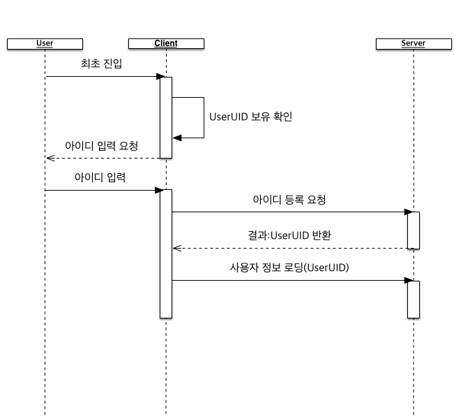
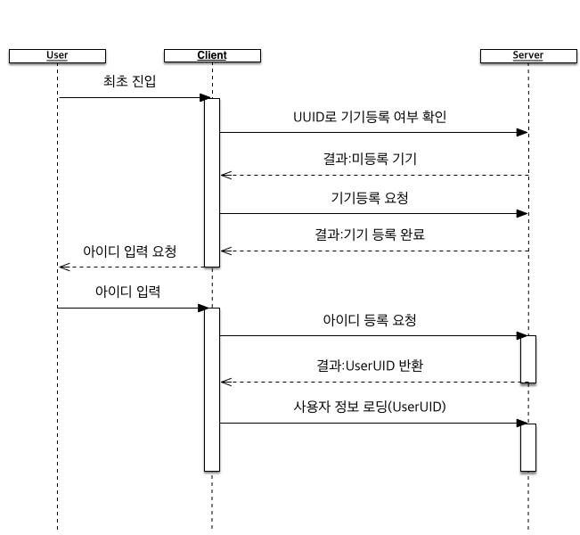
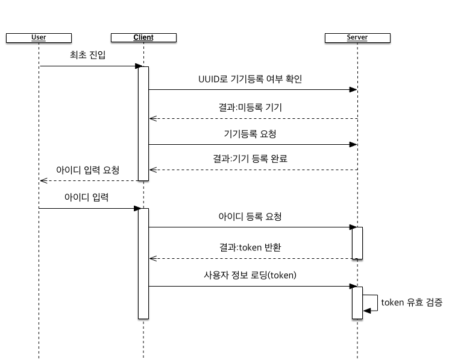
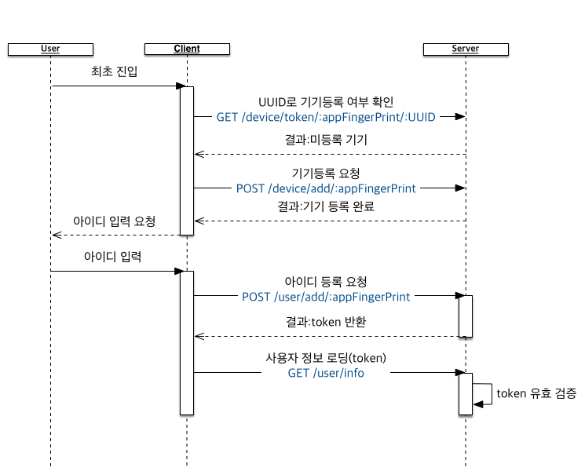
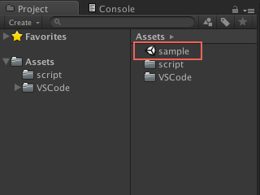
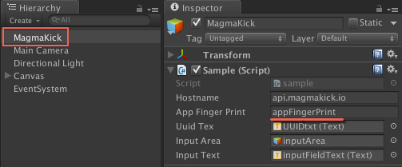
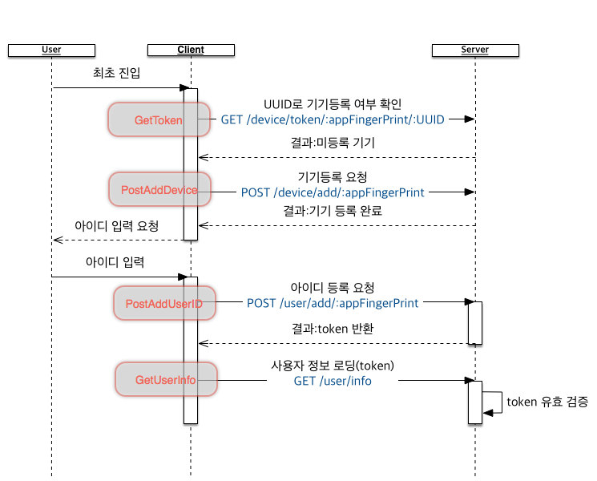

기기등록과 사용자 등록
======

사용자 등록에 대하여
------

## 사용자고유키(UserUID)를 활용한 사용자 확인 

게임에서 사용자는 아이디(혹은 닉네임)을 가지고 있습니다.

그것외에 서로를 구별할 수 있는 정보는 없습니다.

> 이메일을 수집한다면 얘기가 달라지지만요. 게임에서 굳이 이메일 수집은 필요없으니까요.

그럼 아이디를 가지고 사용자 등록을 하는 과정을 살펴보겠습니다.

아이디를 통해 사용자를 등록한 경우 각 아이디별로 한 명의 유저로 판단합니다. 관리 편의를 위해 주민등록번호처럼 UserUID를 발급하게 됩니다.

클라이언트는 UserUID를 저장해서 등록절차를 건너뛸 수 있습니다.

### 리셋 용사의 등장

게임이 최초에 4성 영웅을 랜덤하게 지급한다고 해봅시다. 그러면 사용자 중 몇 명은 더 좋은 등급이 나올때까지 클라이언트를 리셋하면서 좋은 영웅이 나올때까지 작업합니다.

실수로 좋은 결과가 나왔는데 리셋해버리면 복구를 요구합니다. 앞서 소개한 방법으로는 복구 과정이 불편하여 대응이 느릴 수 밖에 없습니다.

대응이 느리면 평점 테러가 이어져서 순위에 영향을 미칩니다.

### 복수의 기기 사용자

스마트폰이 보급되던 초기에는 한 명의 사용자가 한 개의 기기를 사용했습니다. 지금은 테블릿을 같이 사용하거나 저가의 스마트폰을 함께 사용하는 경우도 있습니다.

이런 경우 게임을 여러 기기에서 사용하고 싶어합니다. 집에서 모바일 게임을 즐긴다면 화면이 넓은 테블릿이 더 편할 수 있기때문입니다.

UserUID를 전달할 방법이 마뜩찮아 대응이 불가능합니다. 그럼 무슨 일이 벌어질까요?

## 기기와 사용자 정보 분리

각 기기마다 고유한 식별자(UUID)를 생성하여 서버에 기록한다면 어느 정도 문제를 피할 수 있습니다.

UUID로 기기가 사용하는 사용자 정보를 확인할 수 있으니 리셋 용사의 정보 복구가 용이합니다.

복수의 기기를 사용해도 기기와 사용자 정보만 연결하면 사용자에게 더 좋은 사용환경을 제공할 수 있습니다.

기기 UUID를 등록하고 신규 사용자 계정을 과정을 살펴보겠습니다.

앞서 설명한 과정과 차이라면 UUID를 활용해서 기기 등록 여부를 확인한다는 것입니다. 위 과정을 모두 마쳤다면 클라이언트는 UUID로 서버에서 UserUID를 바로 내려받을 수 있게됩니다.

### UserUID가 주민등록번호처럼 공개되면 어쩌지?

주민등록번호는 편리합니다. 번호만으로 그 사람이 누구인지 확인해니 관공서 업무에 많이 활용됩니다.

거꾸로 말하면 유출 시 손쉽게 다른 사람이 될 수 있습니다.

> 저도 다른 분이 제 주민등록번호로 네이버 아이디를 2개나 만들어서 쓰고 있더군요.

UserUID도 마찬가지 입니다. 클라이언트를 디컴파일하여 UserUID가 어떻게 쓰이는지 확인한다면 서버를 상대로한 공격을 방어하기 어렵습니다.

보안을 위해 UserUID가 아닌 일정 기간만 유효한 토큰(token)을 발급하고 이를 통해 기능을 활용하도록 합니다.

등록과정에서 차이는 토큰을 반환한다는 것과 서버에 무언가 요청할 때 토큰을 활용한다는 점이 변경되었습니다.

서버에서는 토큰이 유효한지 검사하게 됩니다.

MagmaKick 사용자 등록 API
------

앞서 설명한 방법을 MagmaKick에서는 어떻게 사용할까요? API를 간략히 설명하고 실제 사용법을 설명하겠습니다.

MagmaKick의 API는 기기 관련 내용과 사용자 관련 내용을 나눠집니다.

## 기기 관련 API

### UUID를 이용해 토큰 요청

> GET https://api.magmakick.io/device/token/:appFingerPrint/:UUID

UUID를 이용해서 토큰을 획득할 때 사용합니다. 반복하여 API를 호출하는 일을 줄이고자 기기의 등록여부를 서버에서 확인합니다.

### 기기등록

 > POST https://api.magmakick.io/device/add/:appFingerPrint
 
 파라미터
 필드(Field) | 타입(Type) | 설명(Description)
 --- | --- | ---
 UUID | String | 기기의 고유한 값
 DeviceType | String | 기기타입(android, ios 등)
 
 UUID를 전송하여 실제로 기기를 등록할 때 사용합니다.
 
 ## 사용자 관련 API
 
 ### 사용자 등록
 
 > POST  https://api.magmakick.io/user/add/:appFingerPrint
 
  파라미터
 필드(Field) | 타입(Type) | 설명(Description)
 --- | --- | ---
 NickName | String | 사용할 별명(최대 12글자)
 Locale | String | 사용자 국가 및 설정 언어(ex:ko-kr) 
 UUID | String | 기기의 고유한 값(기기와 사용자 연결에 사용)
 
 `아이디를 입력하세요~`로 아이디를 입력받은 경우 클라이언트는 사용자 등록을 이곳으로 보내게 됩니다.
 
 ### 사용자 정보 로딩
 
 > GET  https://api.magmakick.io/user/info
 
 > 토큰 필요
 
사용자 정보를 로딩할 때 사용합니다. 이때 기기 정보를 통해서 발급받은 토큰을 헤더(Header)의 `Authorization` 필드로 함께 보내면 됩니다.

익숙하신 분들이야 어떻게 사용해야겠다고 감이 잡히시겠지만 솔직히 이해하기 힘듭니다. 예제가 필요하겠죠?

사용자 등록 예시
------

진행 과정에 마그마킥 API를 대입하면 다음과 같습니다.

사용자 등록이 필요한 경우 총 4회의 API 요청이 있습니다. 사용자가 체감하는 곳은 아이디 입력 후 등록을 기다리는 부분입니다.

사용자 등록이 완료된 사용자라면 `UUID로 기기등록 여부 확인` 후 토큰을 받아 `사용자 정보 로딩`으로 진입합니다.

## 유니티(Unity) 샘플

위에서 살펴본 과정을 유니티에서 처리하는 샘플을 살펴보겠습니다.

### 작동확인

> [소스코드](https://github.com/magmakick/unitysample/archive/v0.0.1.zip)

소스코드를 다운받고 유니티로 해당 프로젝트를 로딩하면 Assets 폴더에 `sample`씬이 있습니다.

해당 씬을 열어보면 `하이어라키`에 `MagmaKick`이란 게임 오브젝트 나타납니다.

`MagmaKick` 게임 오브젝트에는 `Sample` 컴포넌트가 있습니다.

자신이 등록한 MagmaKick 앱의 appFingerPrint를 입력하고 Play하면 작동을 확인할 수 있습니다.

### Sample.cs 살펴보기

`Sample.cs`의 주요 메서드는 IEnumerator 타입인 아래 4개입니다.

* GetToken
* PostAddDevice
* PostAddUserID
* GetUserInfo

각 메서드는 MagmaKick의 API와 1개씩 대응됩니다.

`Sample.cs`는 Start메서드에서 시작 시 `GetToken`로 기기 등록여부를 확인합니다.

등록되지 않은 경우 `PostAddDevice`를 실행한 뒤 아이디를 입력하도록 UI를 변경합니다.

아이디 입력을 받고 사용자가 Enter 버튼을 클릭하면 `PostAddUserID` 메서드를 실행한 뒤 에러가 없다면 수신한 토큰으로 `GetUserInfo` 메서드를 수행합니다.

만약 `GetToken` 메서드로 바로 토큰을 수신했다면 `GetUserInfo`로 정보 수신을 합니다.

앞서 살펴본 API 호출 과정에 `Sample.cs` 메서드를 대입하면 아래처럼 표현할 수 있습니다.

## 맺음말

MagmaKick을 이용해서 기기와 사용자를 등록하는 과정을 간단히 살펴봤습니다.

하지만 이 기능만 가지고 어떻게 사용자와 기기를 연결하는지 공개되지 않아 궁금하시죠?

많은 앱이 이 부분을 활성화하기 위해서 Facebook, Google 등의 소셜 로그인 기능을 지원합니다.

