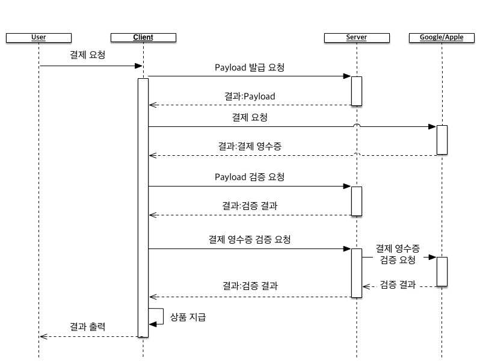
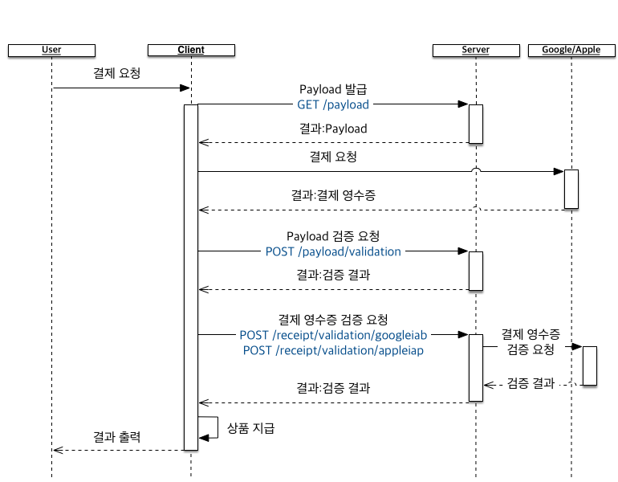

인앱 결제 영수증 검증
======

```

만년 과장으로 C사에 근무하던 A씨가 2015년 9월 희망 퇴직을 했다. 

서른이 넘도록 부모에게 신세지는 슬하의 자녀와 몸이 안좋아 청소일을 쉬고 있는 아내를 생각해서 뭐라도 해보기로했다.

A씨는 5개월여의 준비끝에 집을 반전세로 돌리고 남은 차액과 퇴직금을 털어넣어 `말년 치킨`을 오픈했다.

처음에는 손님이 뜸했지만 배달앱에 리뷰가 잘 올라오면서 서서히 판매량이 늘었다.

하지만 A씨는 창업 6개월 후 자영업을 그만둘 수 밖에 없었다.

이유는 `위조 지폐`와 `장난전화` 매출 때문이었다.

```


과장되고 끝이 이상하지만 위와 같은 사례는 모바일 게임에서도 쉽게 찾아볼 수 있습니다.

인디 게임제작자나 소규모 팀은 개발할 시간도 빠듯하여 개발 후 게임을 출시합니다.

출시된 다수의 모바일 게임이 무료 판매 후 게임 내 결제(이하 `인앱 결제`)로 수익을 올립니다.

> 광고를 통해 수익을 올리는 모바일 게임도 있습니다.

이후 아무리 운영을 잘해도 `앱짱`에 결제해킹 버전이 유통되면 수익을 보장하기 어렵습니다.

불법적으로 가장 비싼 상품을 구매한 사용자가 다수 나타나 상위권 성적을 차지하여 일반 사용자의 게임 욕구를 감소시켜 사용자가 이탈하기도 합니다.


서버로 영수증 검증 하기
------

이런 문제를 피하기 위해 클라이언트는 뷰어가 되고 서버에서 모든 데이터를 처리하도록 하는 것이 좋습니다. 그리고 인앱 결제 영수증을 클라이언트가 아닌 서버에서 검증해야합니다.

그 중 인앱 결제 영수증을 검증하는 방법을 알아보도록 하겠습니다.

## 인앱 결제 순서

과정을 단순하게 설명하면 아래와 같습니다.

1. `사용자`가 결제 요청을 한다.
2. 각 플랫폼(Google Play, Apple AppStore)에 `인앱 결제 요청`을 보낸다.
3. 결제가 완료되면 `결제 영수증`을 포함한 결제 정보가 반환된다.
4. `사용자` 계정에 결제 사항에 따른 상품을 지급한다.

위와 같이 진행될 때 3~4번 사이에 `인앱 결제 영수증`을 검증하면 됩니다. MagmaKick의 인앱 영수증 검증도 이때 이뤄집니다.


이를 바탕으로 Apple `AppStore`의 인앱 결제 순서와 검증 과정을 표현하면 아래와 같습니다.

1. `사용자`가 결제 요청을 한다.
2. `인앱 결제 요청`을 보낸다.
3. 결제가 완료되면 `결제 영수증`을 포함한 결제 정보가 반환된다.
4. 서버에 `결제 영수증`을 검증 요청한다.
5. 검증 결과가 올바르면, `사용자` 계정에 결제 사항에 따른 상품을 지급한다.


Google `Play`의 경우는 1~2번, 3~4번 사이에 Developer Payload 발급과 검증 과정을 추가합니다.

> Developer Payload를 발급하고 검증하는 것은 개발자의 선택입니다. 강제 사항은 아닙니다.

1. `사용자`가 결제 요청을 한다.
2. 서버에 `Payload` 발급을 요청한다.
3. `Payload`와 함께 `인앱 결제 요청`을 보낸다.
4. 결제가 완료되면 `결제 영수증`을 포함한 결제 정보가 반환된다.
5. `결제 영수증`에서 `Payload`를 추출해 서버에 검증을 요청한다.
6. 검증 결과가 올바르면, 서버에 `결제 영수증`을 검증 요청한다.
7. 검증 결과가 올바르면, `사용자` 계정에 결제 사항에 따른 상품을 지급한다.



준비 과정
------

## 구글 Play

구글 Play의 인앱 테스트를 진행하려면 다음 사항이 준비되어야합니다.

* 아래 권한을 포함한 apk를 업로드

```xml
<uses- permission android:name="com.android.vending.BILLING" />
```

apk는 결제용 샘플앱을 활용해서 업로드한 뒤 변경해도 무방하지만 테스트를 구글 Play의 알파나 베타를 활요앻서 배포한 뒤 다운받아야하므로 넉넉히 1시간 이상 기다려야합니다. 

* 최소 1개 이상의 관리되는 인앱 상품 등록

결제 관련 권한을 포함한 apk를 업로드하면 바로 인앱 상품을 등록할 수 있습니다.

* 앱의 영수증을 조회할 수 있는(Games Services Publishing API) `OAuth Client`(웹 애플리케이션용)

이것은 결제하는 과정에서는 필요없으나 MagmaKick에서 인앱 결제 영수증을 구글 서버에서 확인할 때 사용됩니다.

생성하는 과정은 다음과 같습니다.

1. [Google Play 개발자 콘솔](https://play.google.com/apps/publish/)에 로그인합니다.
2. 설정을 클릭합니다.
3. 왼쪽 메뉴에서 **API 액세스**를 클릭합니다.
4. 연결된 프로젝트가 없으면 만듭니다.
5. 연결된 프로젝트하여 [API 관리자](https://console.developers.google.com/apis)로 이동합니다.
6. 왼쪽 메뉴에서 **사용자 인증 정보**를 클릭합니다.
7. 위쪽 메뉴의 **사용자자 인증 정보 만들기**를 클릭한 뒤 **OAuth 클라이언트 ID**를 선택합니다.
8. 애플리케이션 유형을 `웹 애플리케이션`으로 선택한 뒤 **승인된 리디렉션 URI**를 아래 주소로 입력합니다.
    https://magmakick.io/redirect/google/callback
9. 생성을 완료한 뒤 **클라이언트 ID**와 **클라이언트 보안 비밀**을 각각 복사합니다.

이렇게 생성된 **클라이언트 ID**와 **클라이언트 보안 비밀**을 MagmaKick에 등록해야합니다.

1. [MagmaKick](https://magmakick.io)에 로그인 합니다.
2. 등록할 앱이 없다면 생성합니다.
3. 생성된 앱의 **앱 관리**를 클릭합니다.
4. 왼쪽 메뉴의 **설정**을 클릭합니다.
5. Google Authorization 아래 **ClientID**와 **ClientSecret**에 앞서 복사한 **클라이언트 ID**와 **클라이언트 보안 비밀**을 입력한 뒤 `정보변경` 버튼을 클릭합니다.
6. 정보변경이 완료되면 `인증시작` 버튼을 클릭한 뒤 Google의 인증절차를 따릅니다.

> 이 과정은 한번만 완료하면 이후 다시 진행하지 않습니다.   


MagmaKick 인앱 영수증 검증 API
------

## Payload 관련 API

### Payload 발급 요청

> GET https://api.magmakick.io/payload

> 토큰 필요

기기 정보를 통해서 발급받은 토큰을 헤더(Header)의 `Authorization` 필드로 함께 보내면 됩니다.

발급받은 Payload는 Google 인앱 결제 시 `developer payload`로 사용합니다.

### Payload 검증

> POST https://api.magmakick.io/payload/validation

> 토큰 필요

기기 정보를 통해서 발급받은 토큰을 헤더(Header)의 `Authorization` 필드로 함께 보내면 됩니다.

파라미터

필드(Field) | 타입(Type) | 설명(Description)
--- | --- | ---
payload | String | Google 인앱 결제 영수증에서 `developer payload`를 추출하여 검증을 요청한다.


## 인앱 결제 영수증 검증 API

### Google 인앱 결제 영수증 검증 요청

> POST https://api.magmakick.io/receipt/validation/googleiab

> 토큰 필요

기기 정보를 통해서 발급받은 토큰을 헤더(Header)의 `Authorization` 필드로 함께 보내면 됩니다.

파라미터

필드(Field) | 타입(Type) | 설명(Description)
--- | --- | ---
RawReceipt | String | 인앱 결제 후 발급받은 영수증

`RawReceipt`에 포함할 영수증은 대략 다음과 같은 형태입니다.

```json
{
    "orderId":"129",
    "packageName":"com.example.app",
    "productId":"exampleSku",
    "purchaseTime":1345678900000,
    "purchaseState":0,
    "developerPayload":"...",
    "purchaseToken":"..."
}
```

### Apple 앱스토어 인앱 결제 영수증 검증 요청

> POST https://api.magmakick.io/receipt/validation/appleiap

> 토큰 필요

기기 정보를 통해서 발급받은 토큰을 헤더(Header)의 `Authorization` 필드로 함께 보내면 됩니다.

파라미터

필드(Field) | 타입(Type) | 설명(Description)
--- | --- | ---
RawReceipt | String | 인앱 결제 후 발급받은 영수증이나 혹은 `transaction-receipt` 내용

`RawReceipt`에 포함할 영수증은 다음과 같은 형태 입니다.

```json
{
    "verification-state":0,
    "transaction-receipt":"MIISiA...fE=",
    "product-identifier":"sample",
    "transaction-identifier":"8F...AE",
    "quantity":1,
    "transaction-state":1,
    "error":""
}
```

이 중 검증에 사용되는 데이터는 `transaction-receipt`입니다.

> Unity 5.3 이상부터 지원하는 Unity IAP를 사용하는 경우 위 `결제 영수증(Purchase Receipts)`에 `Payload`란 이름으로 `transaction-receipt`를 직접 보여주므로 전송하면 됩니다.


## 유니티(Unity) 샘플

유니티에서 인앱 결제를 진행하고 영수증을 검증하는 생플을 살펴보겠습니다.

### 작동확인

> [소스코드](https://github.com/magmakick/unitysample/archive/0.0.2.zip)

소스코드를 다운받고 유니티로 해당 프로젝트를 로딩하면 Assets 폴더에 `sample`씬이 있습니다.


해당 씬을 열어보면 `하이어라키`에 `MagmaKick`이란 게임 오브젝트 나타납니다.

`MagmaKick` 게임 오브젝트에는 `Sample` 컴포넌트가 있습니다.

자신이 등록한 MagmaKick 앱의 `appFingerPrint`를 App Finger Print에 입력하고, consumable 형태의 인앱 상품명을 `Product ID Consumable`에 입력합니다.


> 이 샘플은 안드로이드앱이나 아이폰앱으로 빌드되어야 정확한 결과를 확인할 수 있습니다.


### Sample.cs 살펴보기

`Sample.cs`에 추가된 MagmaKick API용 메서드는 아래 3개입니다.

* GetPayload
* PostPayloadValidation
* PostReceiptValidation

`GetPayload`와 `PostPayloadValidation`는 순수히 구글 인앱 결제 과정을 강화하는 목적으로 사용합니다.

구글 인앱결제, 애플 인앱결제 모두 `PostReceiptValidation`를 사용해서 인앱 결제 영수증을 검증하도록 했습니다.

> 결제에 관한 전체 과정을 [Unity IAP](https://docs.unity3d.com/Manual/UnityIAP.html) 샘플을 변형하여 사용했으므로 공식문서를 참고하시기 바랍니다.



## 맺음말

영수증 검증을 서버 사이드에서 처리를 해도 불안 요소는 남아있습니다.

모든 재화를 클라이언트에서 관리하게되므로 메모리를 조작하는 방식으로 어뷰징을하는 경우는 막을 수 없습니다.

이러한 문제까지 처리하기위해 MagmaKick에서는 게임 내 재화를 관리하는 기능을 준비중입니다. :)  